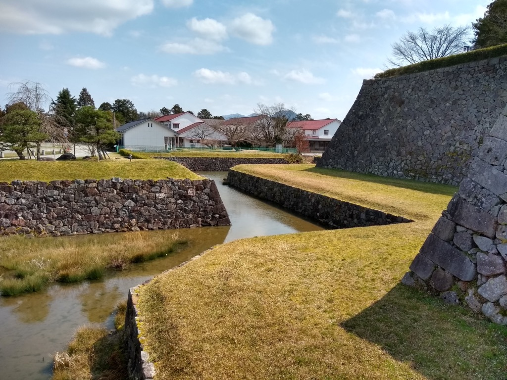
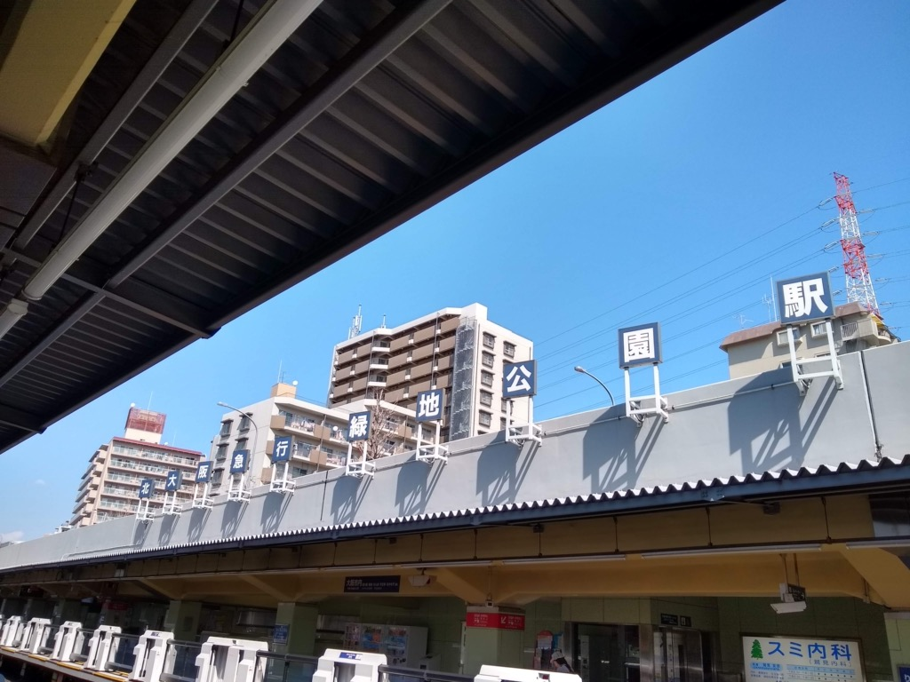
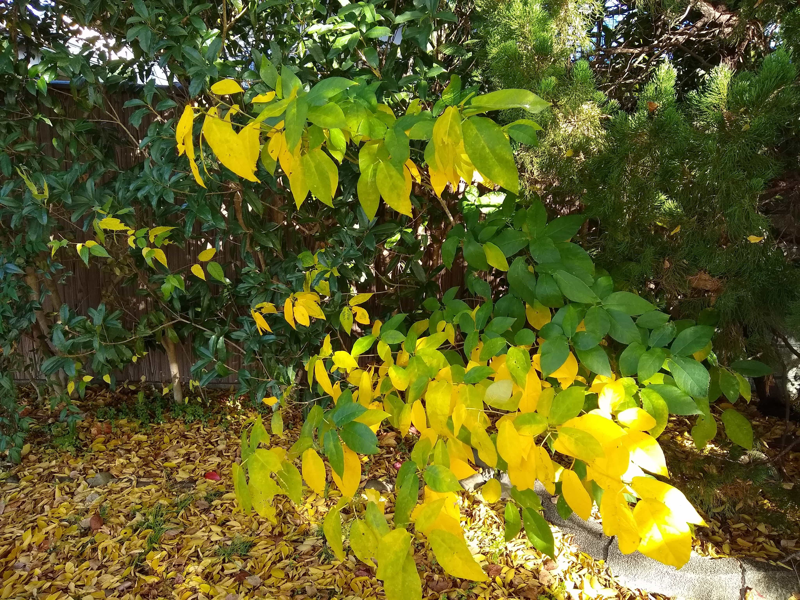
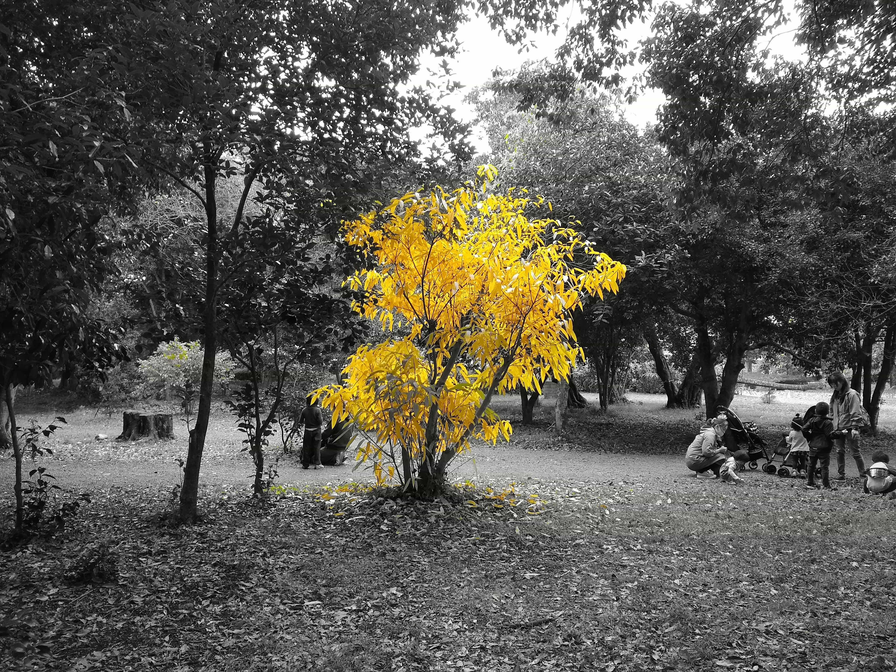
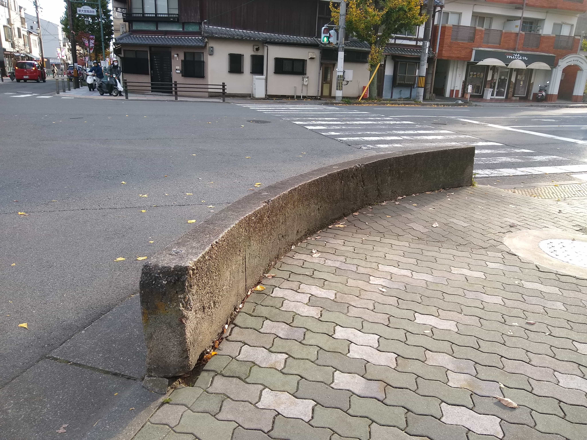
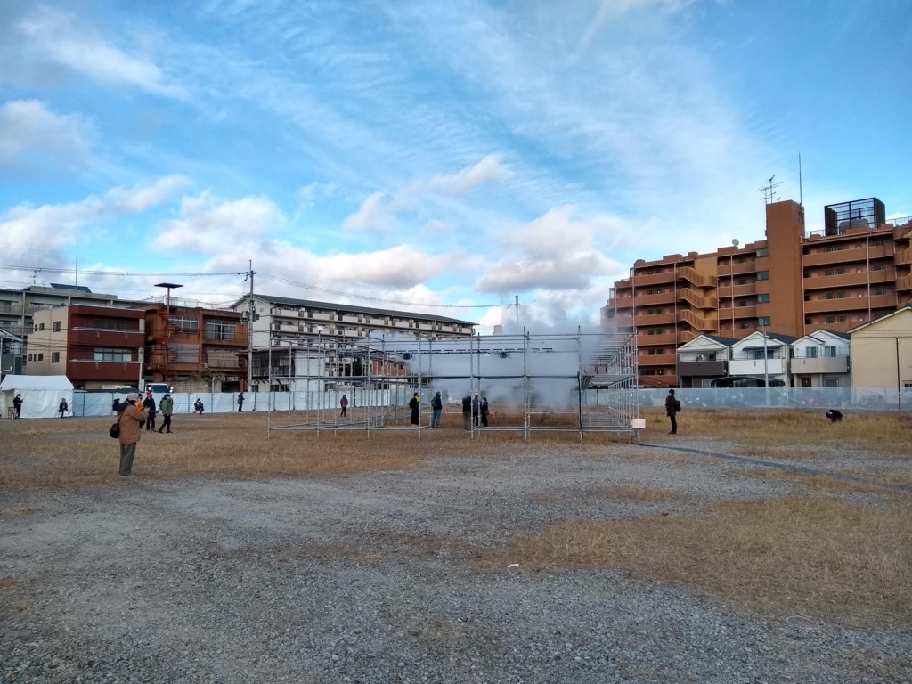

深呼吸して、 写真でも眺めてはいかが？

<h1>2020</h1><h2>1-3</h2>
<a href="pics/2020/winter_1.jpg"></img></a> 節分＠離宮八幡宮
 
<a href="pics/2020/winter_2.jpg"></img></a> 音羽山山頂からの眺望。右手から琵琶湖、山科、京都盆地
 
<a href="pics/2020/winter_3.jpg"></img></a> 高瀬川
 
<a href="pics/2020/winter_4.jpg"></img></a> 御香宮神社の鳥居＠伏見
 
<a href="pics/2020/winter_5.jpg"></img></a> 篠山城
 
<a href="pics/2020/winter_6.jpg"></img></a> 北大阪急行 緑地公園駅
 
<a href="pics/2020/winter_7.jpg"></img></a> 賽の河原的な何か＠鴨川
 <h2>4-6</h2>
<a href="pics/2020/spring_1.jpg"></img></a> 高雄
 
<a href="pics/2020/spring_2.jpg"></img></a> 建勲神社
 
<a href="pics/2020/spring_3.jpg"></img></a> 鴨川
 
<a href="pics/2020/spring_4.jpg"></img></a> 鴨川
 
<a href="pics/2020/spring_5.jpg"></img></a> 近鉄と青年＠鴨川下流
 
<a href="pics/2020/spring_6.jpg"></img></a> 上御霊神社
 
<a href="pics/2020/spring_7.jpg"></img></a> 宝ヶ池
 
<a href="pics/2020/spring_8.jpg"></img></a> 宝ヶ池
 
<a href="pics/2020/spring_9.jpg"></img></a> 上賀茂神社からの眺め
 
<a href="pics/2020/spring_10.jpg"></img></a> 楢の小川＠上賀茂神社
 
<a href="pics/2020/spring_11.jpg"></img></a> あじさい
 
<a href="pics/2020/spring_12.jpg"></img></a> あじさい2
 
<a href="pics/2020/spring_13.jpg"></img></a> 堀川
 
<a href="pics/2020/spring_14.jpg"></img></a> 茶道ストリート（小川通）
 <h2>7-9</h2>
<a href="pics/2020/summer_1.jpg"></img></a> 明治天皇陵＠伏見
 <h2>10-12</h2>
<a href="pics/2020/fall_1.jpg"></img></a> 青い鴨川
 
<a href="pics/2020/fall_2.jpg"></img></a> 晴天の京都御苑
 
<a href="pics/2020/fall_3.jpg"></img></a> ねこ＠六角堂
 
<a href="pics/2020/fall_4.jpg"></img></a> とり＠鴨川
 
<a href="pics/2020/fall_5.jpg"></img></a> 色が多い
 
<a href="pics/2020/fall_6.jpg"></img></a> 消失点
 
<a href="pics/2020/fall_7.jpg"></img></a> 好きな色の組み合わせ
 
<a href="pics/2020/fall_8.jpg"></img></a> フレームができてる＠上御霊神社
 
<a href="pics/2020/fall_9.jpg"></img></a> シンドラーのリスト＠府立植物園
 
<a href="pics/2020/fall_10.jpg"></img></a> 知恩院前の坂
 
<a href="pics/2020/fall_11.jpg"></img></a> トマソン＠北山大宮
 
<a href="pics/2020/fall_12.jpg"></img></a> 賀茂川
 
<a href="pics/2020/fall_13.jpg"></img></a> 東九条で中谷芙二子が<a href="https://liquid-kcua.jp/2020/10/16/exhibition-2020/">インスタレーション</a>をやってたので観に行きました
 
<a href="pics/2020/fall_14.jpg"></img></a> 同上
 
<a href="pics/2020/fall_15.jpg"></img></a> 同上
 
<a href="pics/2020/fall_16.jpg"></img></a> 堀川正面から東を向くと、仏具店の奥に本願寺伝道院がみえる。京都でもっとも好きな風景のひとつ。<a href="https://www.youtube.com/watch?v=4-zb56Zxn5g">動画版</a>
 
<a href="pics/2020/fall_17.jpg"></img></a> 西本願寺の門の飾り。Tシャツにプリントしたい
 
<a href="pics/2020/fall_18.jpg"></img></a> 西本願寺で水槽を支える小人たち。

 

<h1>2021</h1><h2>1-3</h2>
<a href="pics/2021/winter_1.jpg"></img></a> エモタワー
