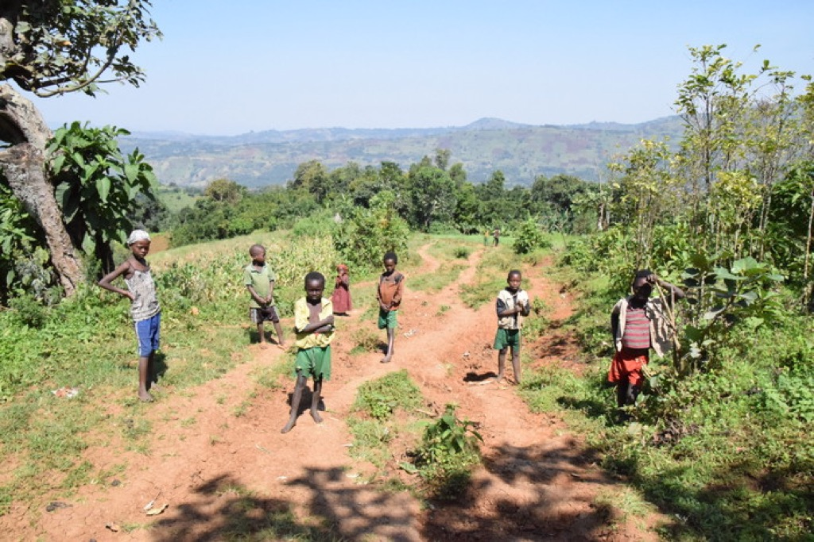
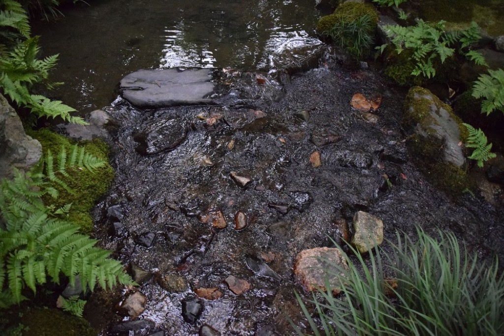
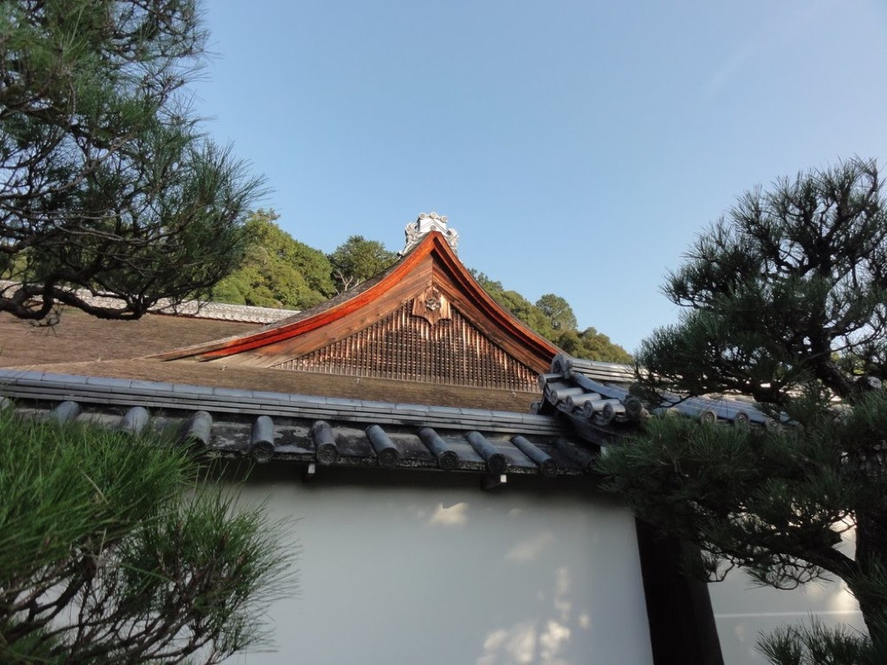
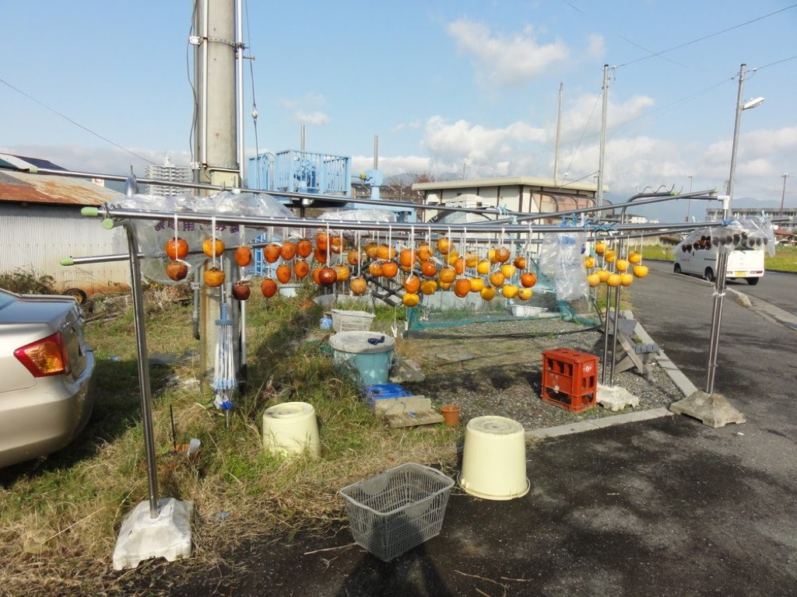

# 2016

66枚あります。[写真トップページ](https://keisato0.github.io/pics/)へ

- [1-3](#1-3)
- [4-6](#4-6)
- [7-9](#7-9)
- [10-12](#10-12)

## 1-3

  
下記え

## 4-6

  
お地蔵さん

  
法然院の桜

  
貴船

  
鳥居本

  
よくいる人たち

  
琵琶湖のなかにある離島、沖島を訪問したときの一枚

  
沖島の鳥

  
赤山禅院

  
御堂筋にて

  
清水寺

  
清水の裏らへん

  
高瀬川のあじさい

  
木屋町六条らへん

  
大豊神社の狛犬

  
大豊神社のうさぎ

  
左の人の耳が長い

## 7-9

  
蟻鱒鳶ル

  
ここからしばらくエチオピアの写真です。その1、アディスアベバの路上

  
アディスアベバの八百屋

  
ハイレ・セラシエの寝室＠国立博物館

  
主食、インジェラ。慣れるとけっこう美味しいが、辛い

  
某地方都市

  
泊まっていた部屋その1

  
泊まっていた部屋その2

  
南部の某農村にて。絶景

  
牛

  
ヒッピーみたいな牛

  
市が立つと村は大賑わい

  
どうも、お騒がせしております

  
ジャケ写

  
きれい

  
なんとなく京都っぽくもある夕陽

  
アビイ・ロード

  
テーブルツリー

  
電信柱

  
車中から撮ったら面白い感じになった

  
帰りの空港にて。カバンも作っていたとは

  
石清水八幡宮

  
つくづくいいロゴだよな

  
無鄰菴

  
無鄰菴

  
神戸

  
神戸市立博物館の前の銅像

  
あるね

## 10-12

  
京都国立博物館から京都タワー

  
馬町

  
天橋立

  
伊根

  
こういう雲はなんというのだろう

  
道巾せまし君

  
尋常ならざる光景

  
横顔

  
神馬と修学旅行生の共演

  
日文研の一般公開に行った

  
庭にこんなのが置かれていた

  
中之島四丁目2

  
700円カット

  
どこを撮っても映える哲学の道

  
泉屋博古館の前かな？

  
南禅寺の塔頭

  
かも

  
柿を干している＠滋賀県堅田

  
堅田

  
摩天楼

  
こどもさん、っていうのがすごく京都っぽいです

---
[このページのトップ](#2016)へ

[写真トップ](https://keisato0.github.io/pics/)へ
