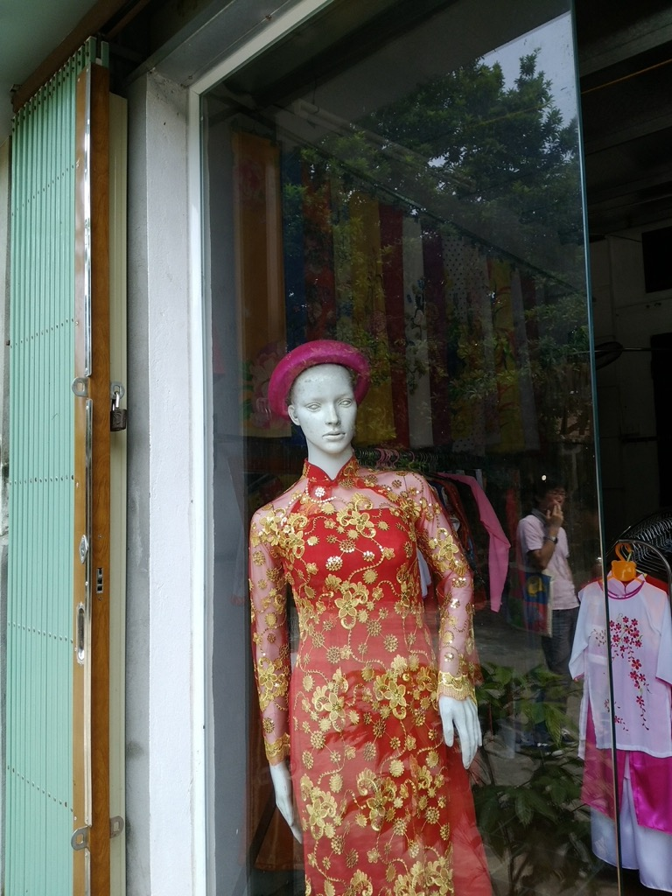
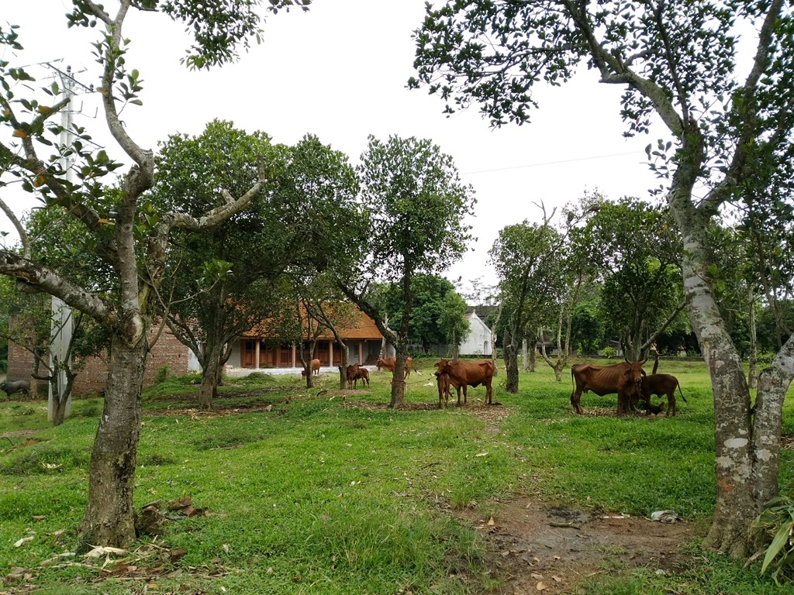
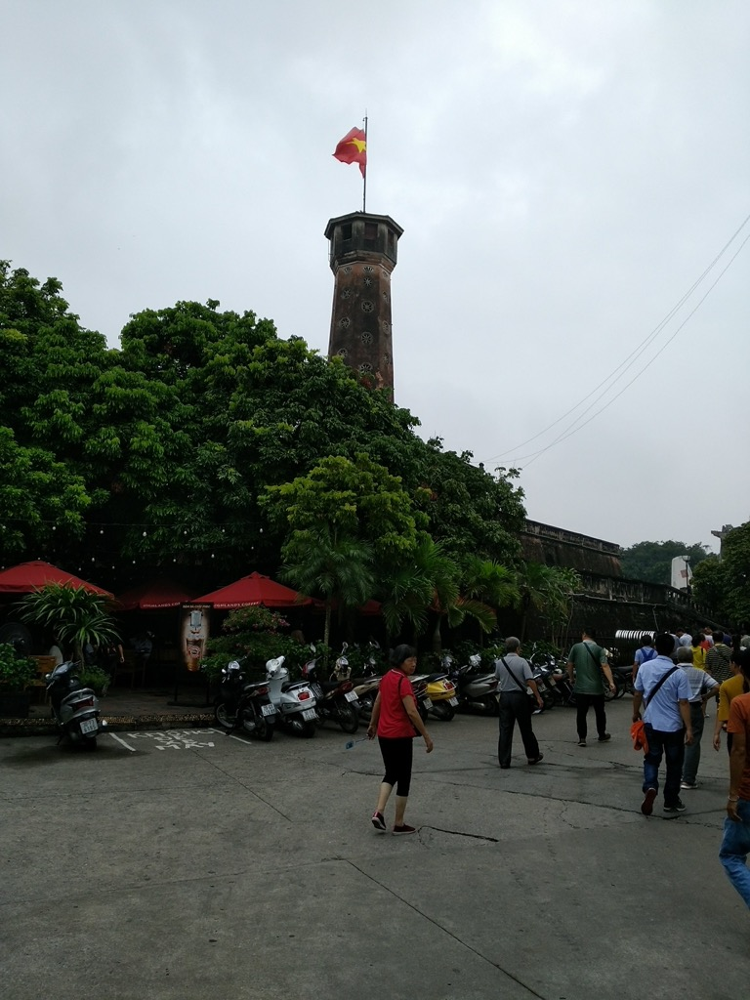
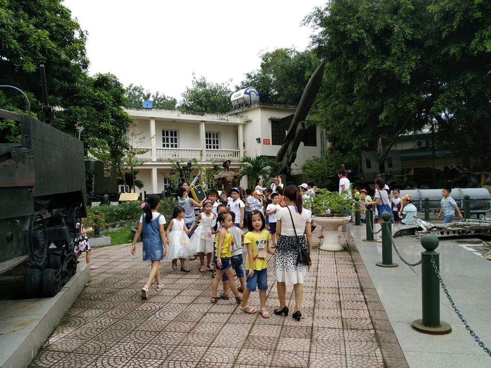
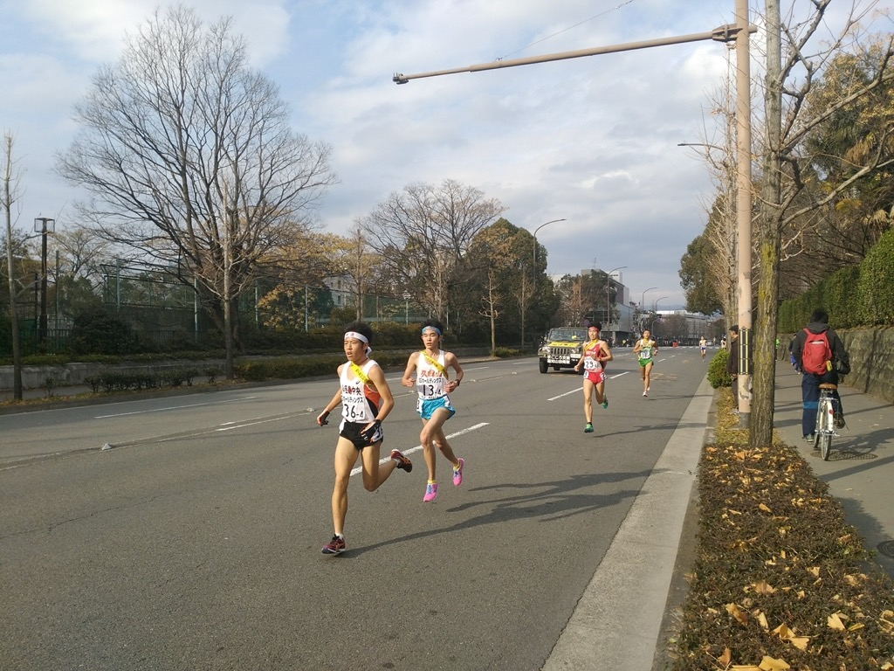
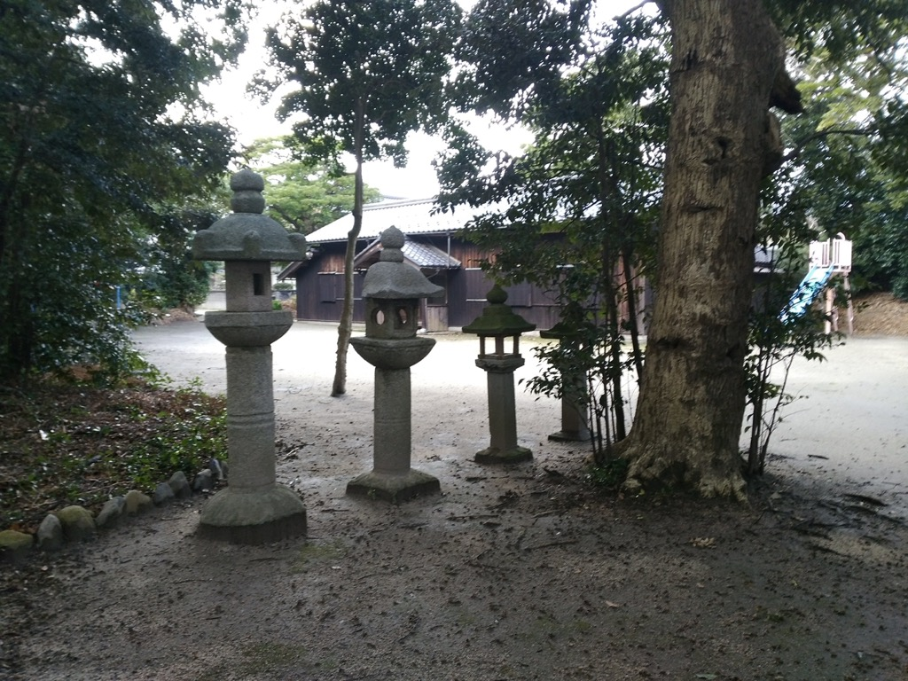
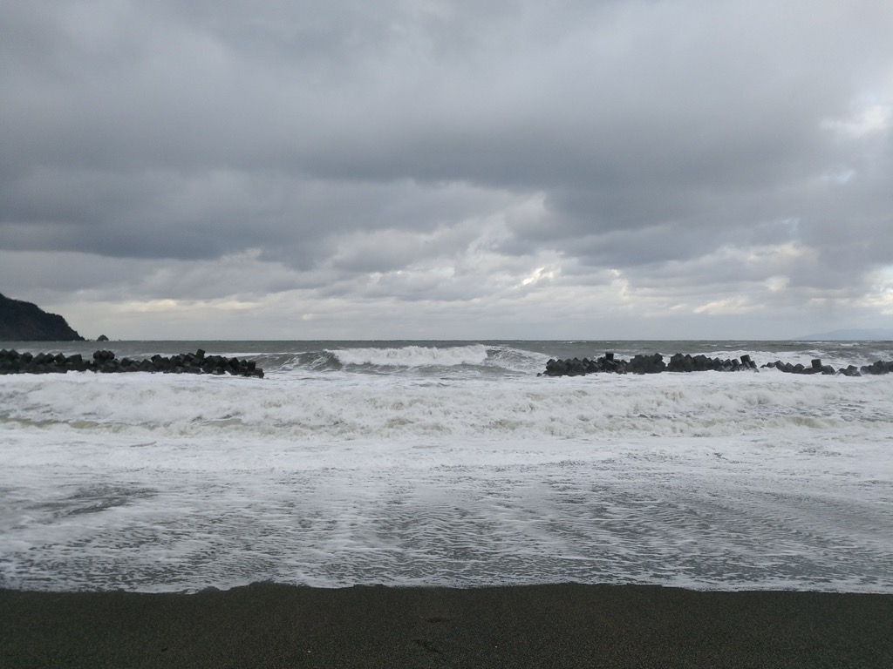
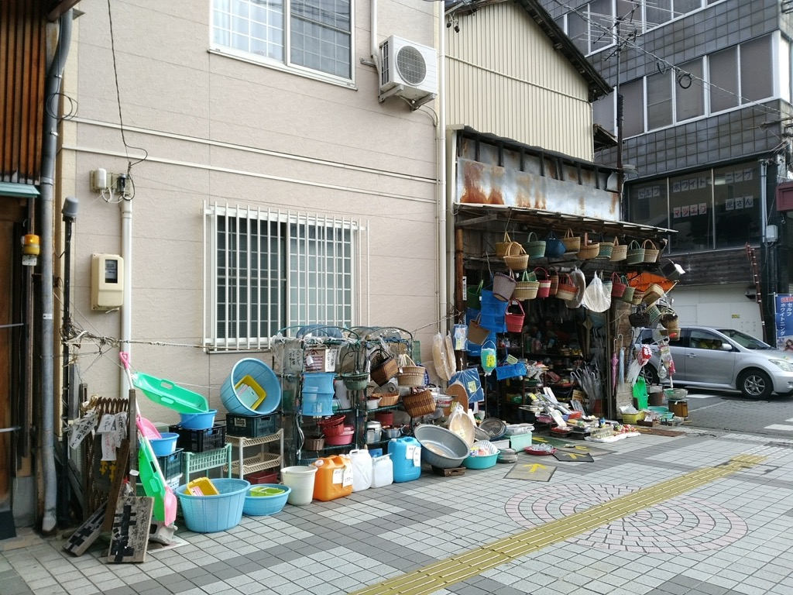
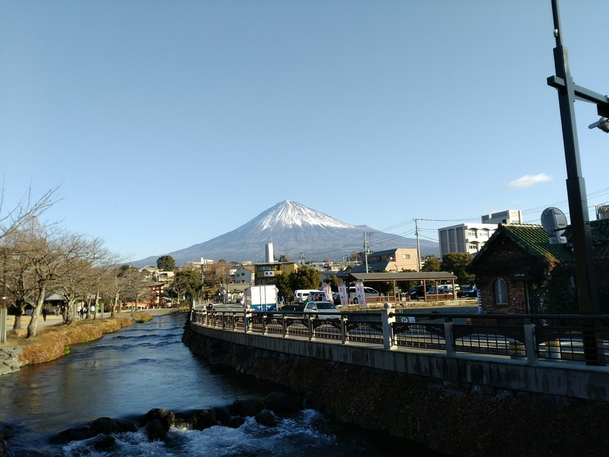

# 2017

51枚あります。[写真トップページ](https://keisato0.github.io/pics/)へ

- [1-3](#1-3)
- [4-6](#4-6)
- [7-9](#7-9)
- [10-12](#10-12)

## 1-3

  
どうもどうも。

  
北の丸三きょうだい

## 4-6

  
すごい自信だ

  
鹿と目が合った＠北白川天神宮

  
神武天皇陵。果たしてお墓のなかには何かあるのか...!?

  
お、おう

  
左側の人がかなりヤバいことをやっている

## 7-9

  
祇園祭、結局この年しか行ってないな。激混みで萎える

  
仰せの通りにしました!

  
佐賀関

  
国東半島の磨崖仏

  
台湾の果物屋

  
ミャンマー移民の人が多いエリアにて

  
食べたい

  
ファミマ

  
団地（立ち入りと撮影には許可をもらいました）

  
中正紀念堂

  
いいね

  
故宮博物館のガイドのおじさん

  
かわいい

  
淡水

  
淡水

  
淡水のアビイ・ロード

  
敦賀の港のコンテナ

  
金沢21世紀美術館

  
金沢、京都より京都っぽいかも(?)

## 10-12

  
蓬莱山から琵琶湖をのぞむ

  
毘沙門堂

  
長等公園から大津市街をのぞむ

  
長等公園いいよね

  
水色京阪

  
みどりの京阪

  
お、おう

  
光化門前@ソウル

  
清渓川

  
鉱山労働者のマネキン@熊野

  
瀞峡

  
静かな琵琶湖

  
NA

  
NA

  
NA

  
NA

  
NA

  
NA

  
NA

  
NA

  
NA

  
NA

  
NA

  
NA

  
NA

---
[このページのトップ](#2017)へ

[写真トップ](https://keisato0.github.io/pics/)へ
