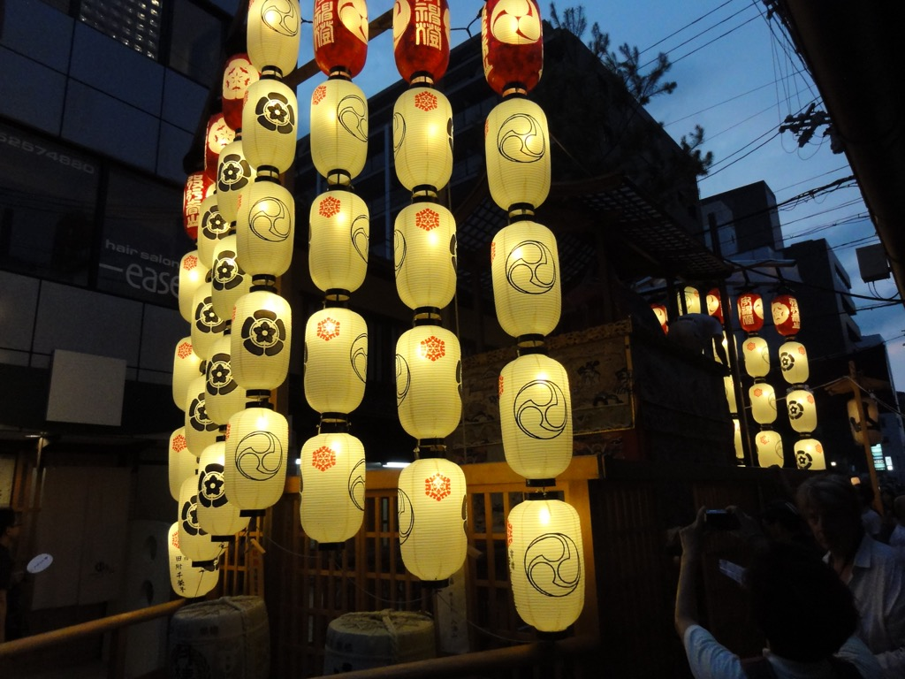

# 2017

42枚あります。[写真トップページ](https://keisato0.github.io/pics/)へ

- [1-3](#1-3)
- [4-6](#4-6)
- [7-9](#7-9)
- [10-12](#10-12)

## 1-3

  
どうもどうも。

  
北の丸三きょうだい

## 4-6

  
すごい自信だ

  
鹿と目が合った＠北白川天神宮

  
神武天皇陵。果たしてお墓のなかには何か入ってるのか...!?

  
お、おう

  
左側の人がかなりヤバいことをやっている

## 7-9

  
祇園祭、結局この年しか行ってない。激混みで萎えるのだ

  
仰せの通りにしましたよ

  
カボチャ供養なる謎のイベントに行きました

  
かなり独特な味のカボチャくれました

  
姫路城

  
姫路城の猫さん

  
まあ誰かにとってのふるさとではあるだろうが

  
大原

  
上野駅公園口。柳美里の小説、まだ読んでないな。東上野は私のルーツでもある

  
銀座線の踏切

  
大阪某所、下町

  
ハロン湾

  
ハノイのマネキンは何を思う

  
牛

  
社会科見学に来たと思しき子ら＠ベトナム軍事歴史博物館

## 10-12

  
秋葉ダム＠浜松市

  
秋野不矩美術館。展示物と藤森照信の設計のマッチが素敵〜!

  
百万遍古本市

  
浜大津! 近畿地方を代表する風景のひとつだと思う!

  
宝が池公園

  
AED講習会のキャストたち＠自動車学校

  
あまりにも味のある看板

  
八坂の塔

  
素晴らしい展示でした

  
和歌山城から市内を

  
確かに好感度の高い老人にはなりたい＠和歌山城公園

  
金比羅宮

  
金比羅宮の神馬

  
左に見えるは讃岐富士

  
可愛い牛乳箱＠善通寺市内

  
大根が干されている＠桂川沿い

  
駅伝マン＠東山通

  
冬の日本海＠福井・美浜町

  
よろずや＠大垣

  
富士宮市内。どこからでも富士山がみられる街

---
[このページのトップ](#2017)へ

[写真トップ](https://keisato0.github.io/pics/)へ
