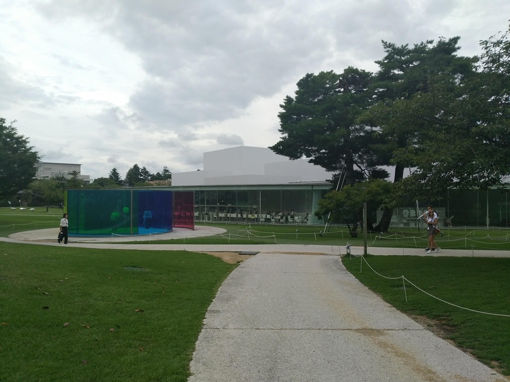
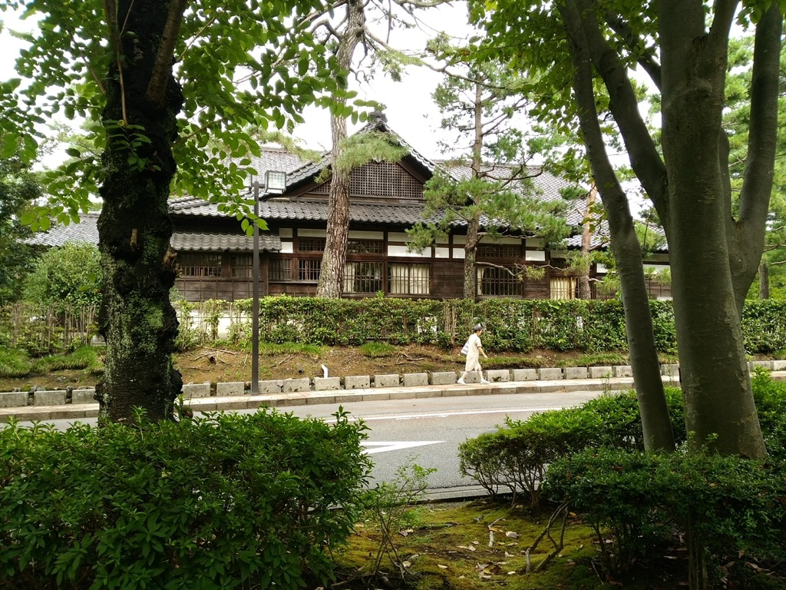

# 2018

42枚あります。[写真トップページ](https://keisato0.github.io/pics/)へ

- [1-3](#1-3)
- [4-6](#4-6)
- [7-9](#7-9)
- [10-12](#10-12)

## 1-3

これから追加されます

## 4-6

ぼてっとしてていいですね

鴨川で遊歩道が一番狭くなるあたり

バス運転手の休憩所@比叡平。ちょっと画面が汚れていますが

元田中

## 7-9

佐賀関

国東半島の磨崖仏

台湾の果物屋

ミャンマー移民の人が多いエリアにて

食べたい

ファミマ

団地（立ち入りと撮影には許可をもらいました）

中正紀念堂

いいね

故宮博物館のガイドのおじさん

かわいい

淡水

淡水

淡水のアビイ・ロード

敦賀の港のコンテナ

金沢21世紀美術館

金沢、京都より京都っぽいかも(?)

金沢のかえるさんたち

犀川

ザ・金沢って感じの風景

早朝の兼六園。誰かはわからん

浅野川

白川郷を撮る人たち

白川郷の家の礎石

知らん人の墓@白川郷

熊野灘だな

## 10-12

蓬莱山から琵琶湖をのぞむ

毘沙門堂

長等公園から大津市街をのぞむ

長等公園いいよね

水色京阪

みどりの京阪

お、おう

光化門前@ソウル

清渓川

鉱山労働者のマネキン@熊野

瀞峡

静かな琵琶湖

---
[このページのトップ](#2018)へ

[写真トップ](https://keisato0.github.io/pics/)へ
