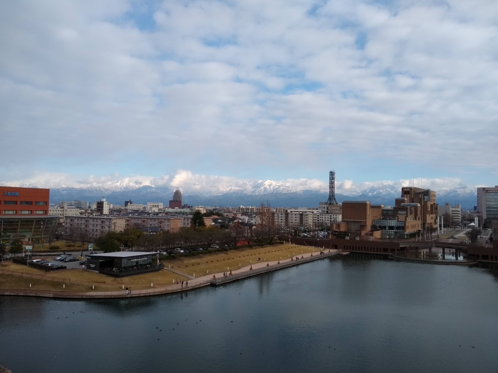

# 2019

61枚あります。[写真トップページ](https://keisato0.github.io/pics/)へ

- [1-3](#1-3)
- [4-6](#4-6)
- [7-9](#7-9)
- [10-12](#10-12)

## 1-3

左手にタワーが見えますよ

なんとなく東京下町感がある今熊野

芦屋浜団地。屏風。

宝塚。この後、右手に映ってる温泉に入った

近江八幡

赤羽台団地のスターハウス

桐ヶ丘商店街

高島平

高島平

江戸東京たてもの園

江戸東京たてもの園

## 4-6

柳橋っぽいが、兵庫県の明石

須磨の海

須磨の駅

鹿ヶ谷の公園

鹿ヶ谷の訳ありそうなビル

木屋町。ブレッソン風ショットに挑戦しようと思い人の往来を待っていたところ、おじさんが通過してくれた

香港。この1週間後くらいからデモが一気に活発になった。その後の展開はご承知のとおり

高密度な街だ

こんなところ高すぎて怖いよう...。

曇天の大文字

## 7-9

細うで繁盛記@名古屋駅

あいちトリエンナーレ、おもしろかったな〜。

あいトリの作品

瀬戸

瀬戸

あいトリピエロ

同一人物

浄土寺浄土堂

鶴林寺

鶴林寺

鶴林寺

鶴林寺

高砂の工業地帯

よくないですか？

高砂海浜公園で私たちを待っている動物たち

アビイ・ロード

往時の面影をしのばせる高砂市街

富田林

百万遍の老翁

唐突だけど、言われて悪い気はしない。どういたしまして。

## 10-12

おそらく四条大橋から北向きで撮った一枚。京都で撮った写真の中でベスト級。

哲学の道

同上

淀川の向こうに梅田のビル群

梅田の北側って非常に興味深いエリアですよね

東山東一条

汐見橋駅。この駅の漂わせている哀愁はすごい。

大阪市街・西部。などと書くと岸政彦みたいだな。まあ実際、エモいよね

九条商店街

大阪観光の名所・安治川隧道

余呉湖

富山城

立山に抱かれる富山市街

八村塁もこの橋を通ったのだろうか

あのこは貴族

雁木通り@高田

高田世界館でアンパンマン観ました（スケジュール的にそれしか観れなかった）

年末だが雪は降っていなかった

牛に引かれて善光寺参り、っていい言葉ですよね

長野電鉄長野駅のベンチがかわいい

---
[写真トップページ](https://keisato0.github.io/pics/)へ
