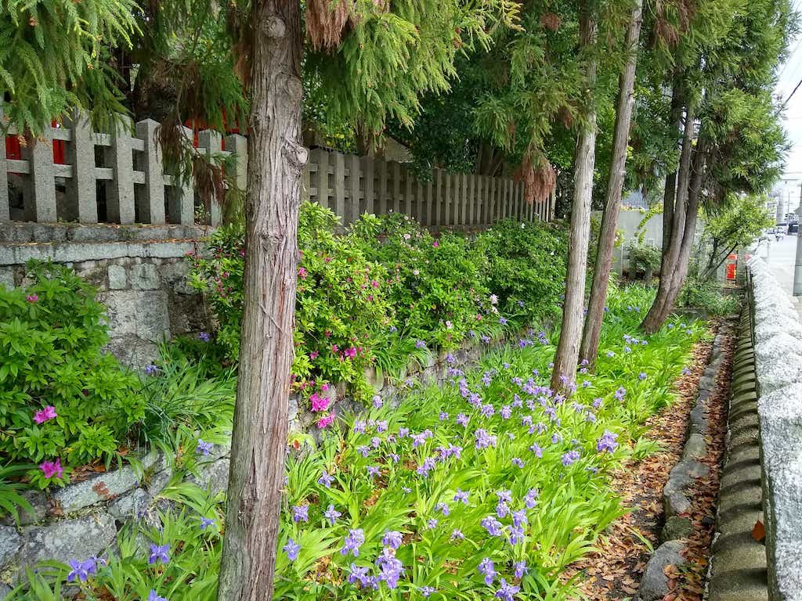

# 2020

40枚あります。[写真トップページ](https://keisato0.github.io/pics/)へ

- [1-3](#1-3)
- [4-6](#4-6)
- [7-9](#7-9)
- [10-12](#10-12)

## 1-3

節分＠大山崎神社

音羽山山頂からの眺望。右手から琵琶湖、山科、京都盆地

高瀬川

御香宮神社の鳥居＠伏見

篠山城

北大阪急行 緑地公園駅

賽の河原的な何か＠鴨川

## 4-6

高雄

建勲神社

鴨川

鴨川

近鉄と青年＠鴨川下流

上御霊神社

宝ヶ池

宝ヶ池

上賀茂神社からの眺め

楢の小川＠上賀茂神社

あじさい

あじさい2

堀川

茶道ストリート（小川通）

## 7-9

明治天皇陵＠伏見

## 10-12

青い鴨川

晴天の京都御苑

ねこ＠六角堂

とり＠鴨川

色が多い

消失点

好きな色の組み合わせ

フレームができてる＠上御霊神社

シンドラーのリスト＠府立植物園

知恩院前の坂

トマソン＠北山大宮

賀茂川

東九条で中谷芙二子が<a href="https://liquid-kcua.jp/2020/10/16/exhibition-2020/">インスタレーション</a>をやってたので観に行きました

同上

同上

堀川正面から東を向くと、仏具店の奥に本願寺伝道院がみえる。京都でもっとも好きな風景のひとつ。<a href="https://www.youtube.com/watch?v=4-zb56Zxn5g">動画版</a>

西本願寺の門の飾り。Tシャツにプリントしたい

西本願寺で水槽を支える小人たち。

---
[写真トップページ](https://keisato0.github.io/pics/)へ
