# 2021

15枚あります。[写真トップページ](https://keisato0.github.io/pics/)へ

- [1-3](#1-3)
- [4-6](#4-6)
- [7-9](#7-9)
- [10-12](#10-12)

## 1-3

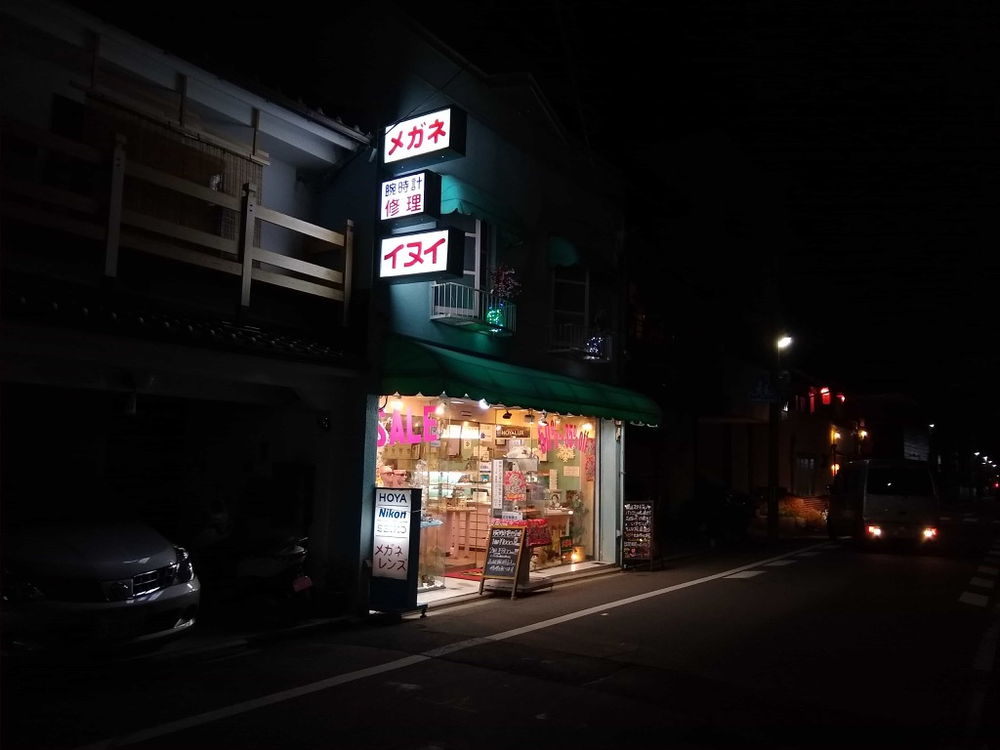
光る眼鏡屋

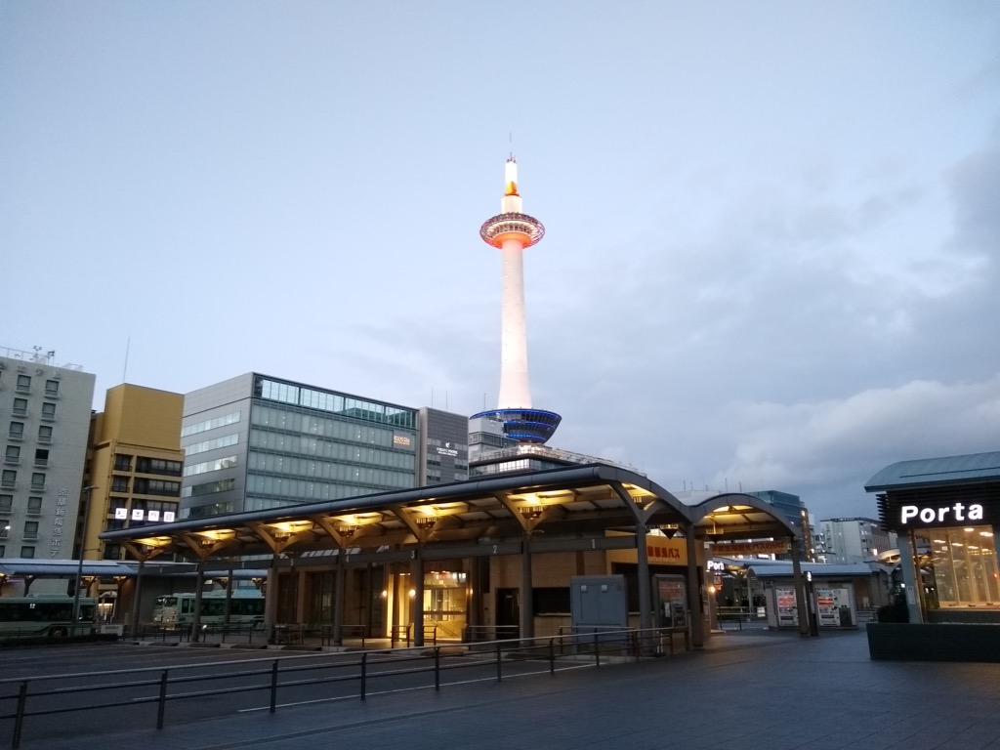
色合いが淡い

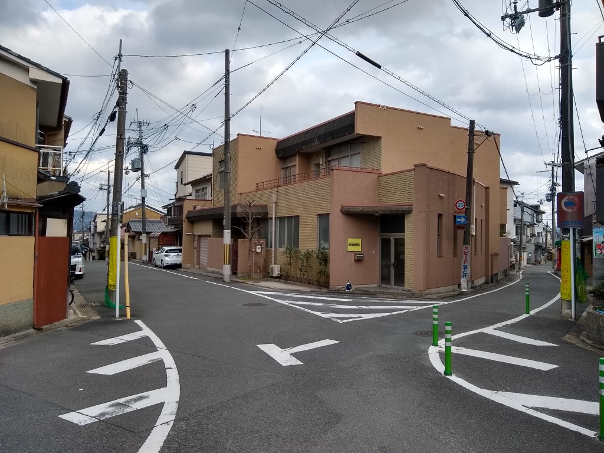
いい感じの三叉路

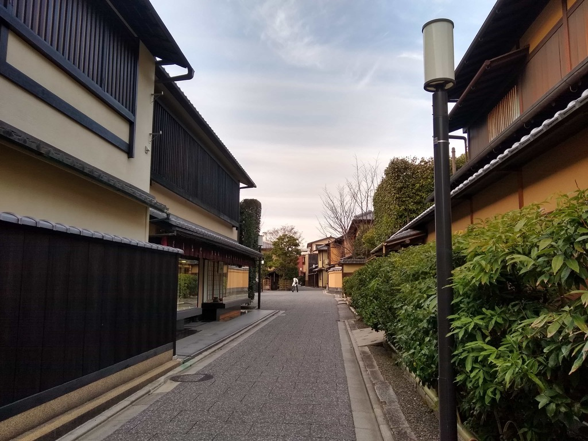
小川通（茶道ストリート）

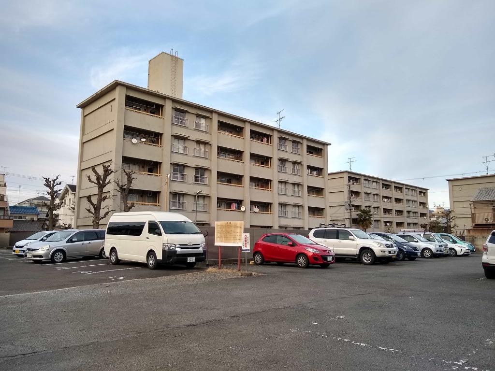
いい感じの建物

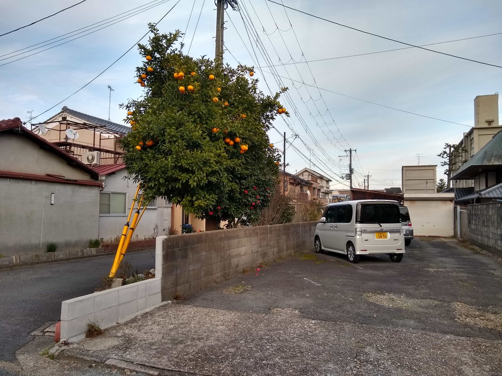
みかん

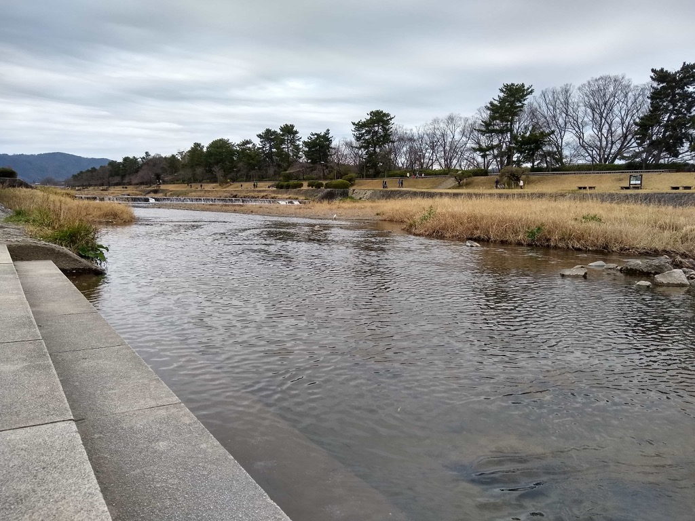
カモ・リヴァー

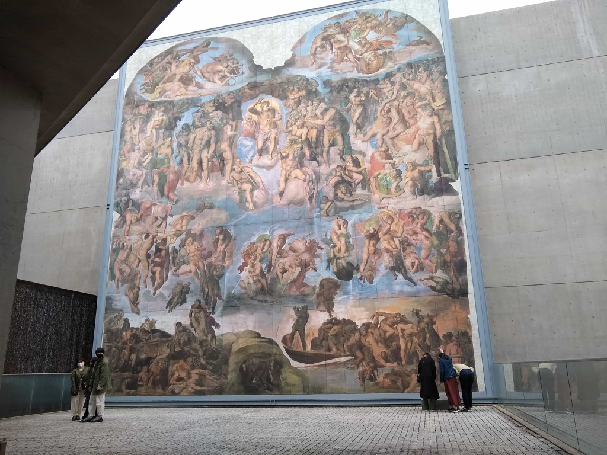
たまたま無料公開日だったので入ってみた陶板名画の庭@北山

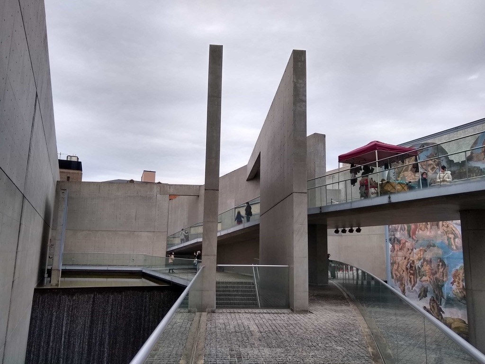
同上

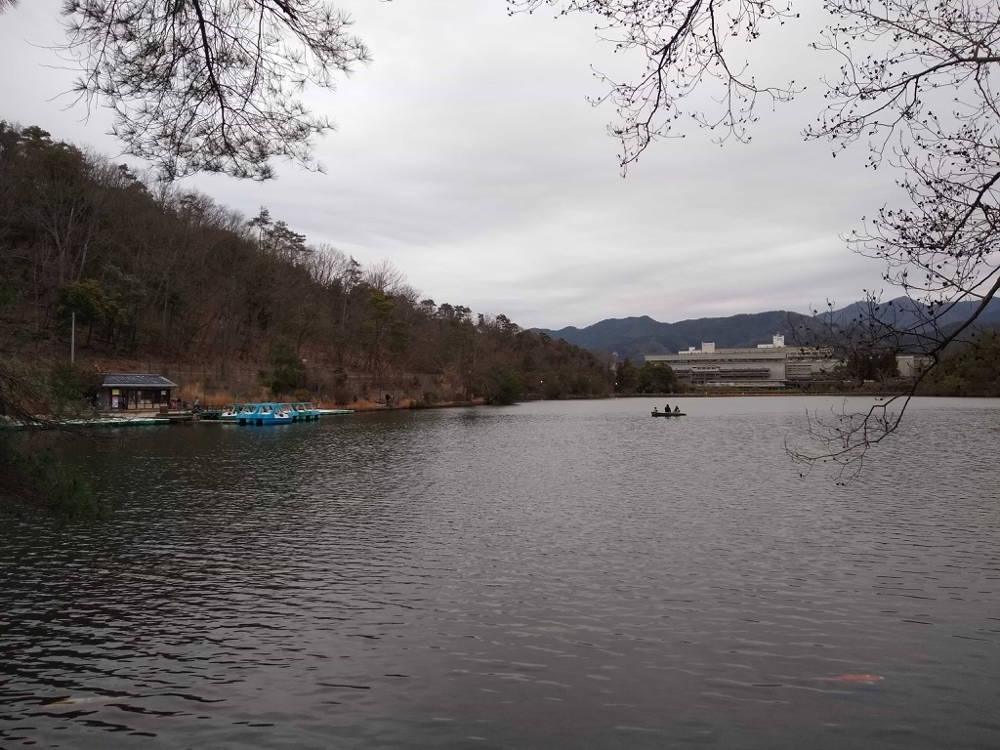
私も貸しボートに乗りたい

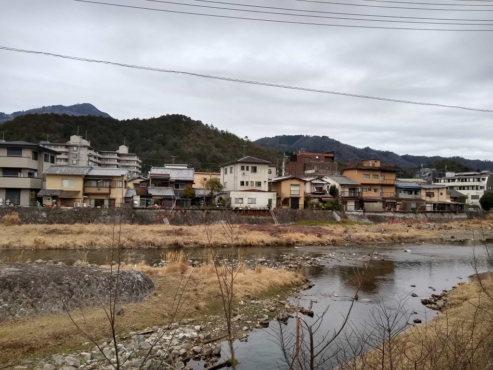
温泉街みたいな高野川沿い

桜もさることながら、春は芽吹き始めた緑色があざやかですね

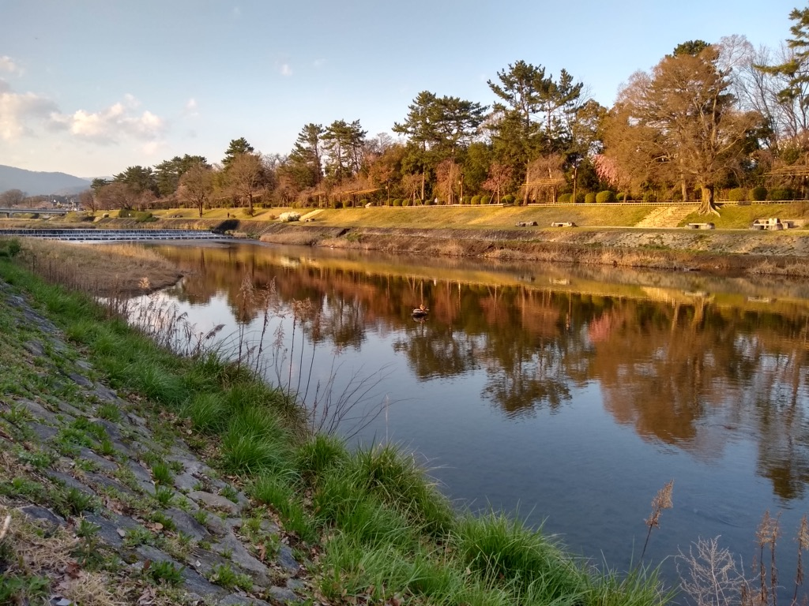
真ん中らへんに鴨が2匹いるよ

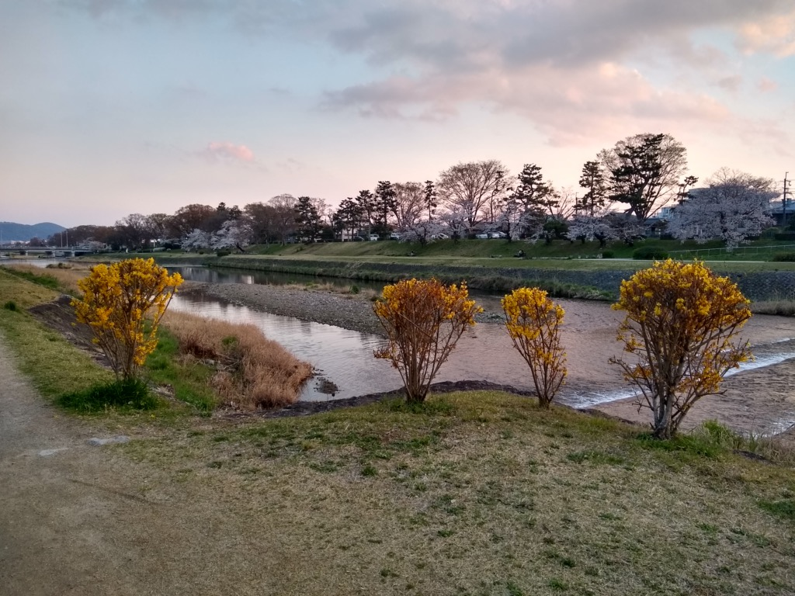
賀茂川等間隔

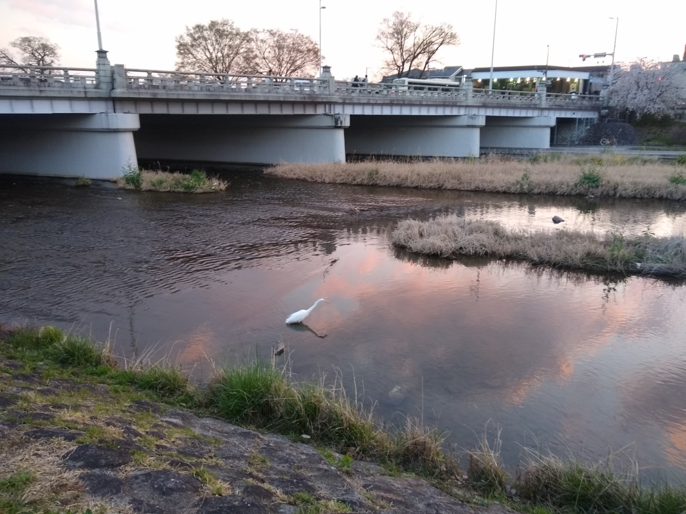
白鳥はかなしからずや...

## 4-6

これから追加されます

## 7-9

これから追加されます

## 10-12

これから追加されます
