# 2021

37枚あります。[写真トップページ](https://keisato0.github.io/pics/)へ

- [1-3](#1-3)
- [4-6](#4-6)
- [7-9](#7-9)
- [10-12](#10-12)

## 1-3

  
光る眼鏡屋

  
色合いが淡い

  
いい感じの三叉路

  
小川通（茶道ストリート）

  
いい感じの建物

  
みかん

  
カモ・リヴァー

  
たまたま無料公開日だったので入ってみた陶板名画の庭@北山

  
同上

  
私も貸しボートに乗りたい

  
温泉街みたいな高野川沿い

  
桜もさることながら、春は芽吹き始めた緑色があざやかですね

  
真ん中らへんに鴨が2匹いるよ

  
賀茂川等間隔

  
白鳥はかなしからずや...

## 4-6

  
なんらかの花

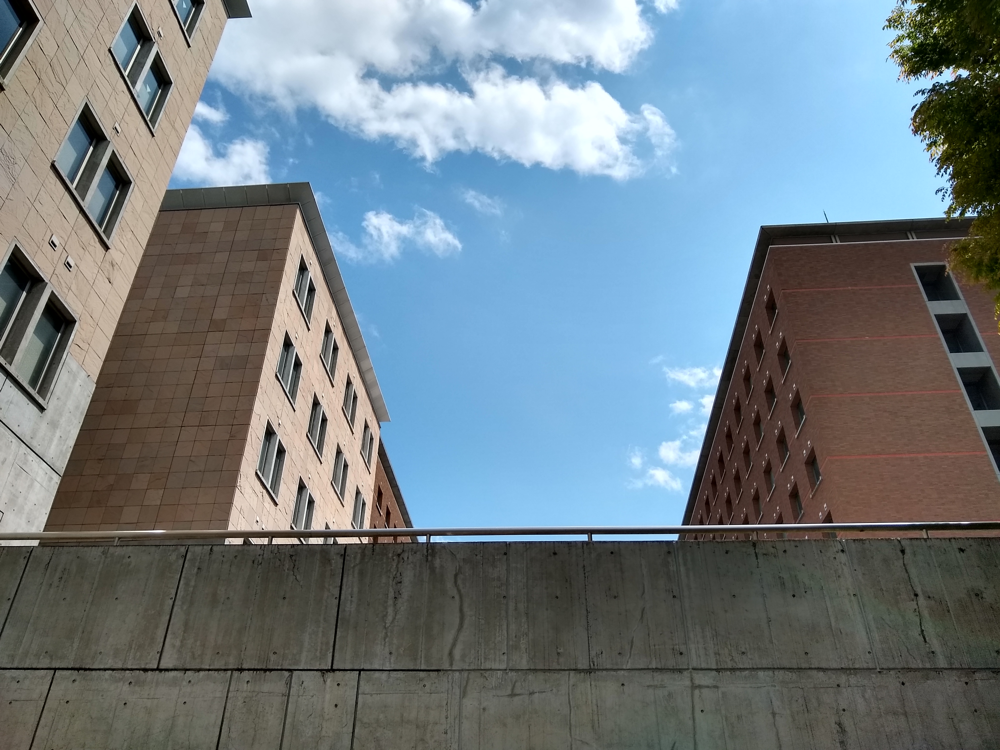  
空

  
緑深い木造家屋

  
青空の下の木造家屋

  
大雨のあとの賀茂川

  
鹿さん

  
淡い色のあじさい

  
光を浴びるあじさい

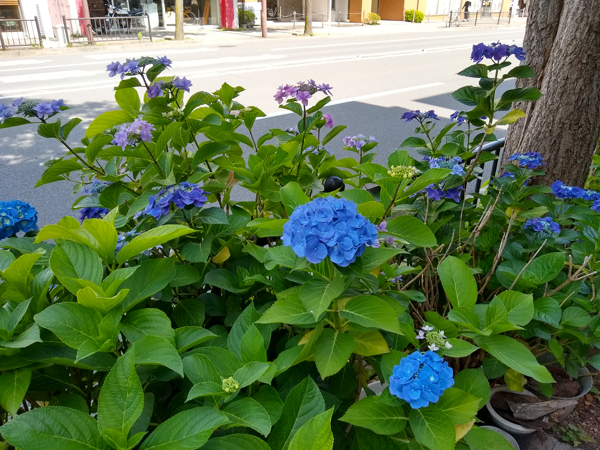  
青のあじさい

  
人生の交錯

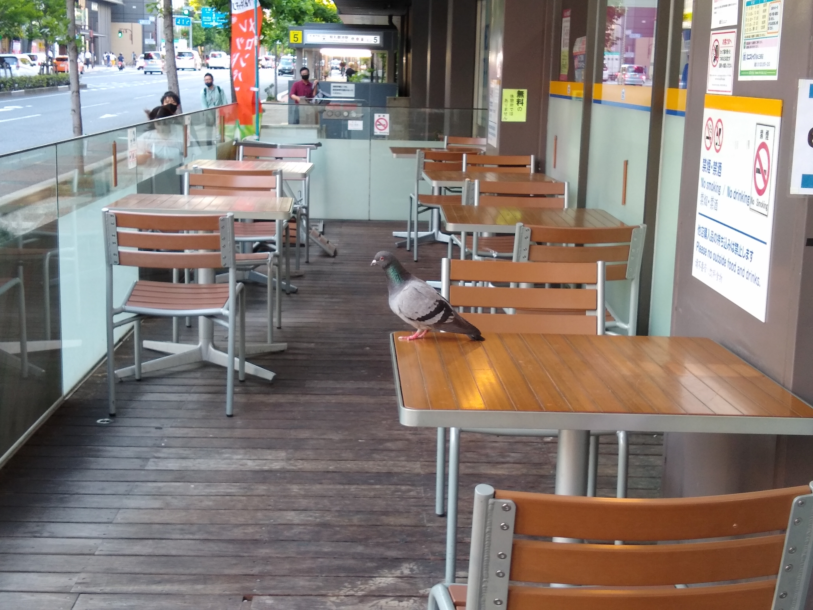  
珍客あらわる

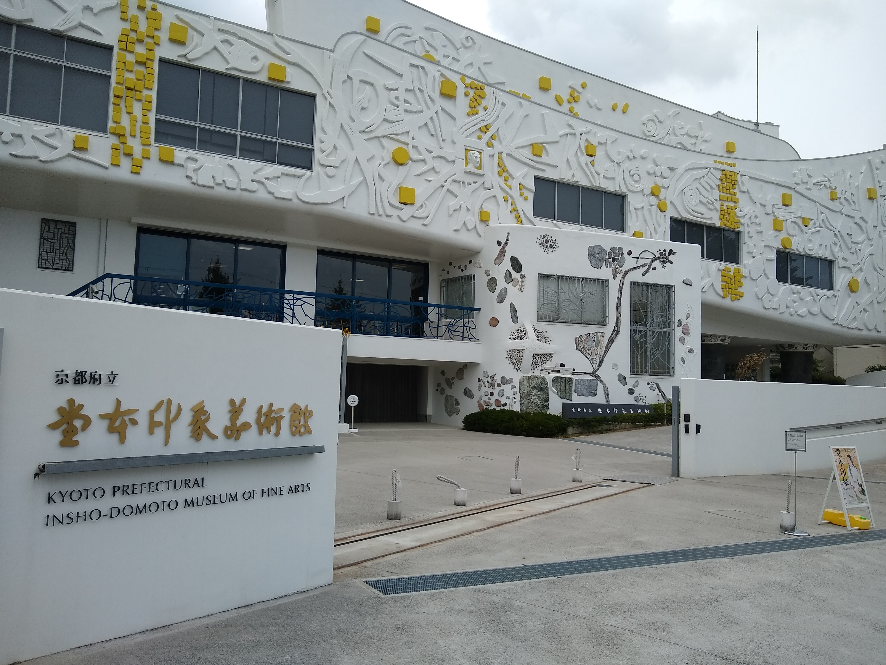  
行った

## 7-9

  
垂れ下がるあじさい

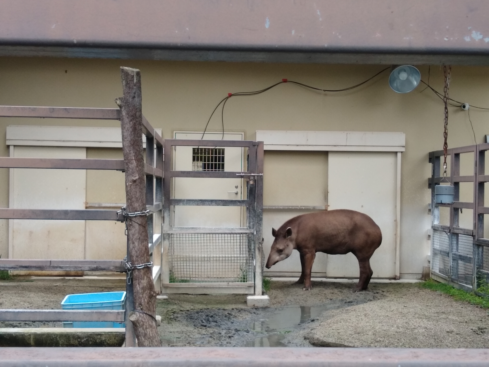  
うなだれるバク

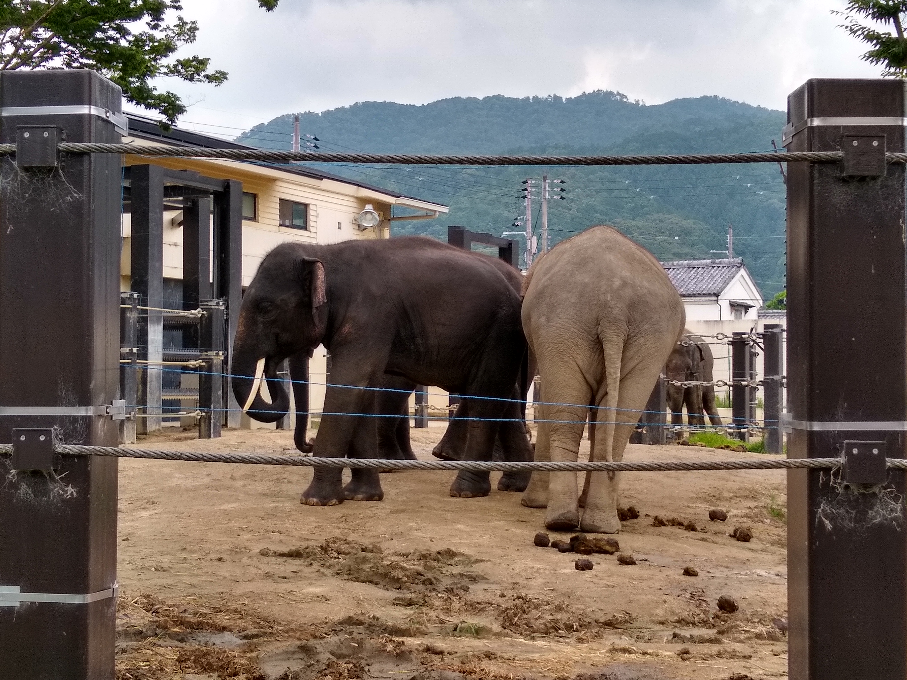  
ひしめきあうゾウ

  
べっぴんさん（オスかもしれないが）

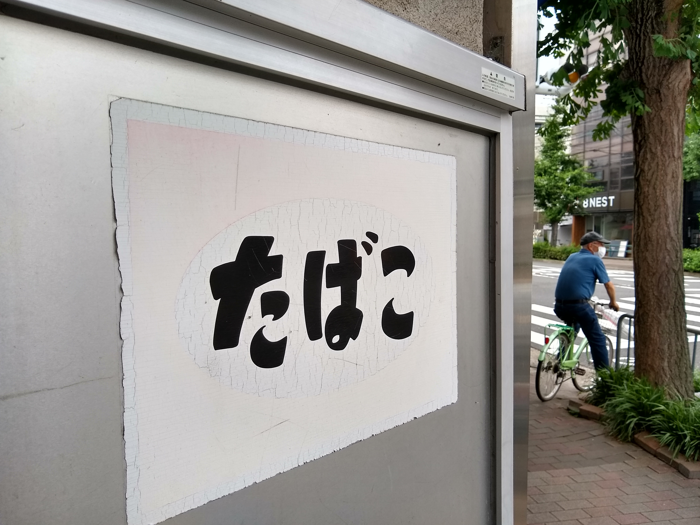  
たばこ＠荒神口

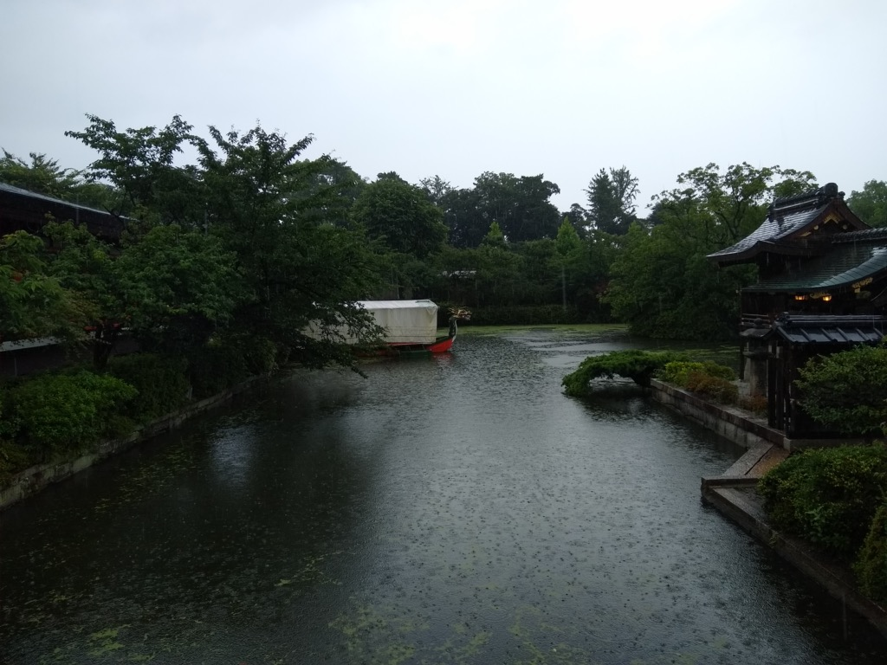  
ドラゴンボート＠神泉苑

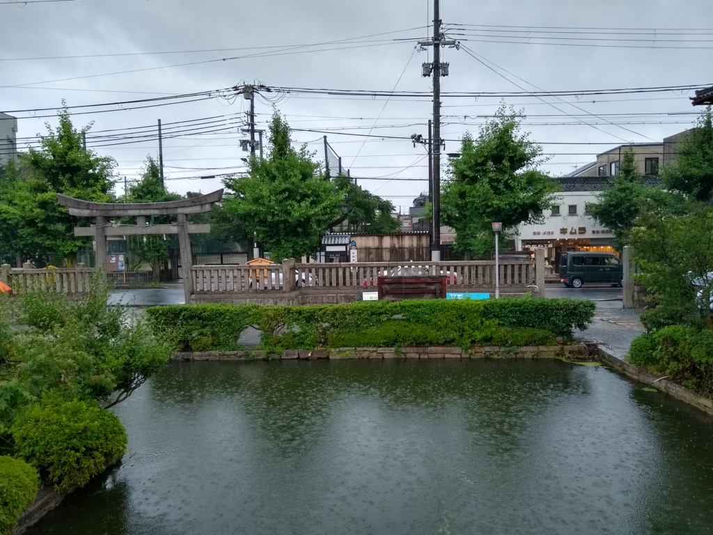  
ちょうどこの日このあたりで神泉苑からアヒルが脱走したらしい

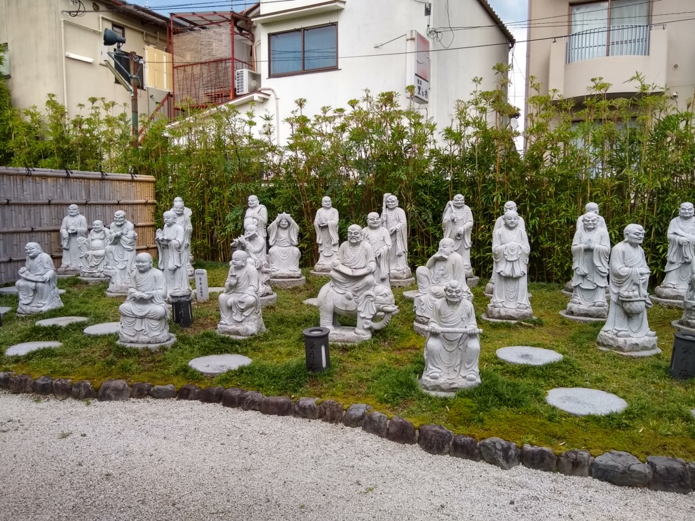  
おじさんたち

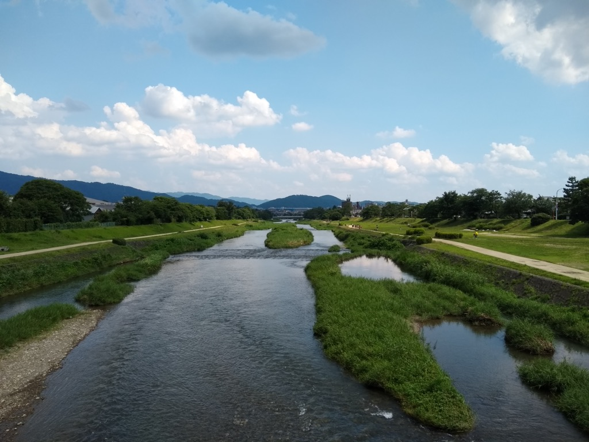  
いつものアングル

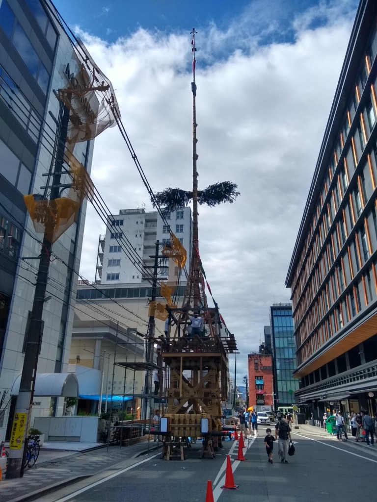  
祇園祭にかかわるなんらかの物体＠室町四条下ル

## 10-12

これから追加されます

---
[このページのトップ](#2021)へ

[写真トップ](https://keisato0.github.io/pics/)へ
