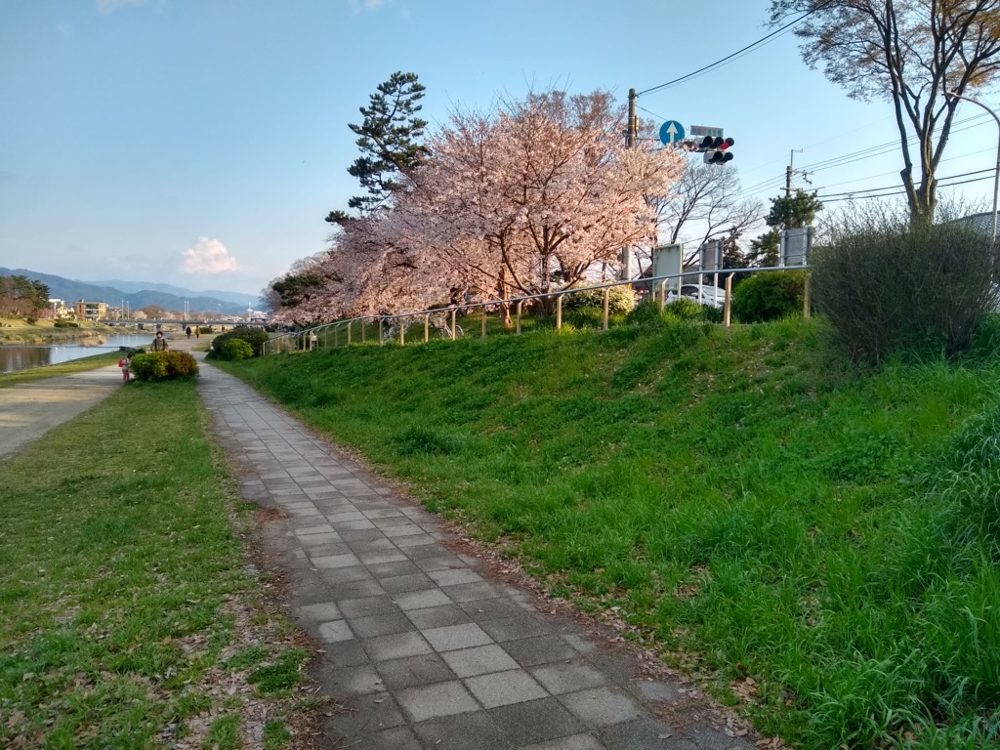

# 2021

15枚あります。[写真トップページ](https://keisato0.github.io/pics/)へ

- [1-3](#1-3)
- [4-6](#4-6)
- [7-9](#7-9)
- [10-12](#10-12)

## 1-3

光る眼鏡屋

色合いが淡い

いい感じの三叉路

小川通（茶道ストリート）

いい感じの建物

みかん

カモ・リヴァー

たまたま無料公開日だったので入ってみた陶板名画の庭@北山

同上

私も貸しボートに乗りたい

温泉街みたいな高野川沿い

桜もさることながら、春は芽吹き始めた緑色があざやかですね

真ん中らへんに鴨が2匹いるよ

賀茂川等間隔

白鳥はかなしからずや...

## 4-6

これから追加されます

## 7-9

これから追加されます

## 10-12

これから追加されます
