# 京都の写真

---

## 春2020

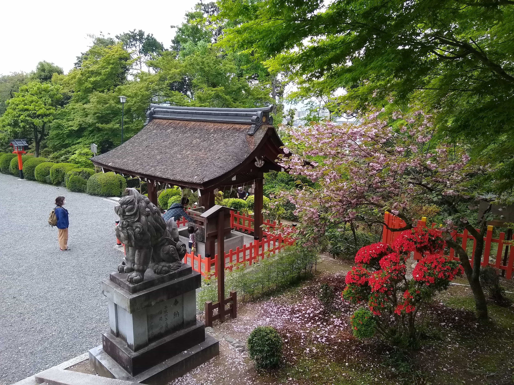

↑建勲神社

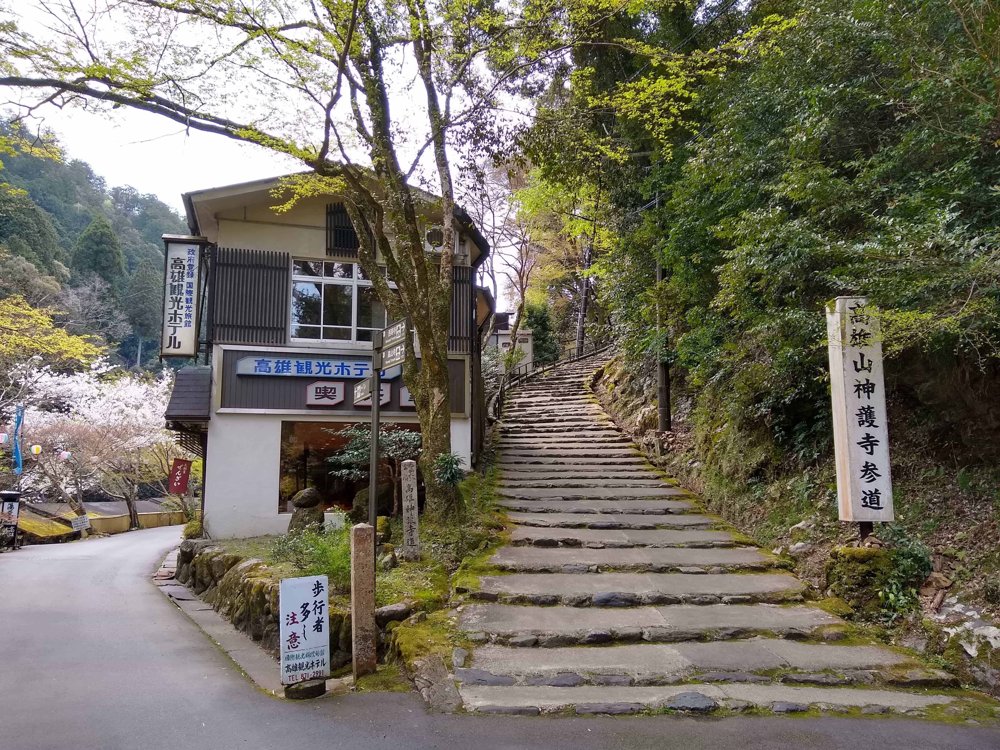

↑高雄

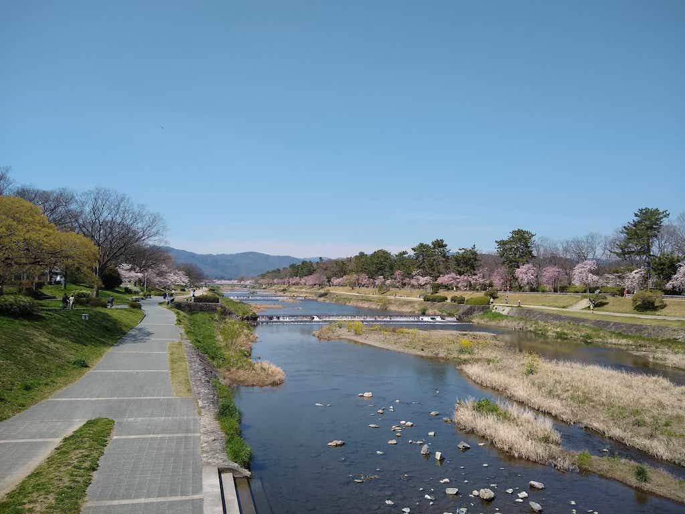

↑賀茂川

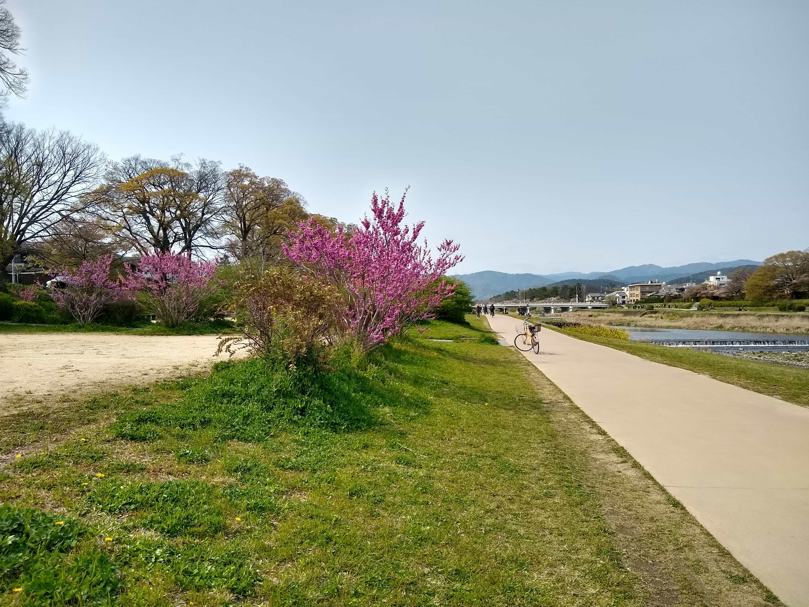

↑賀茂川

↑鴨川下流，オレンジ色の近鉄とオレンジ色の通行人

---

## 初夏2020

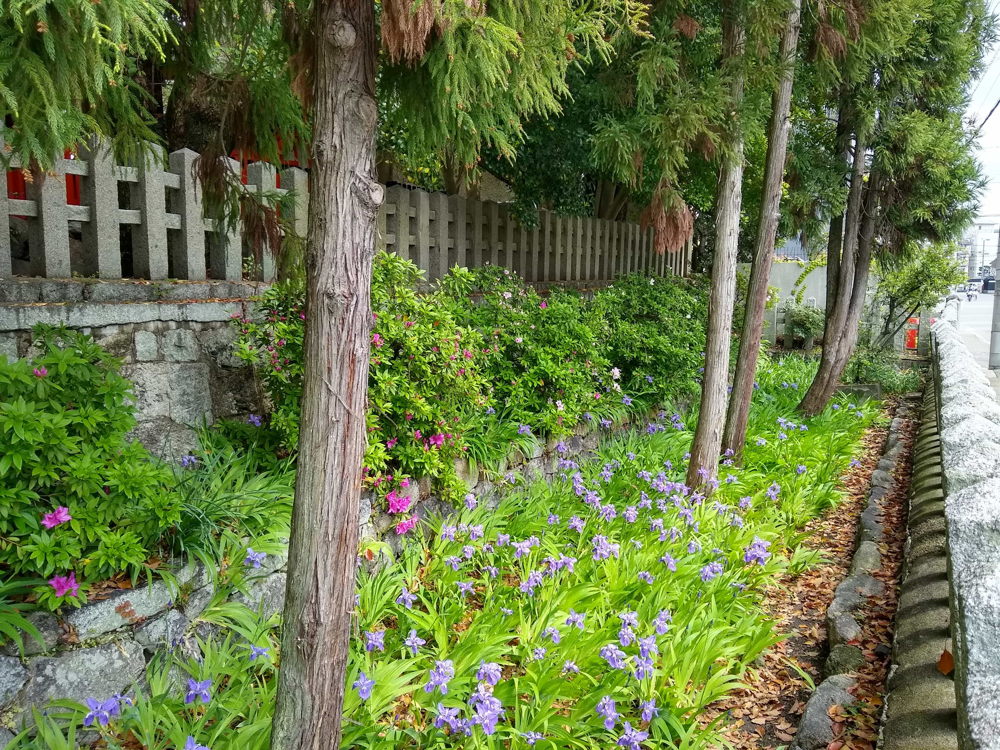

↑上御霊神社のカキツバタ

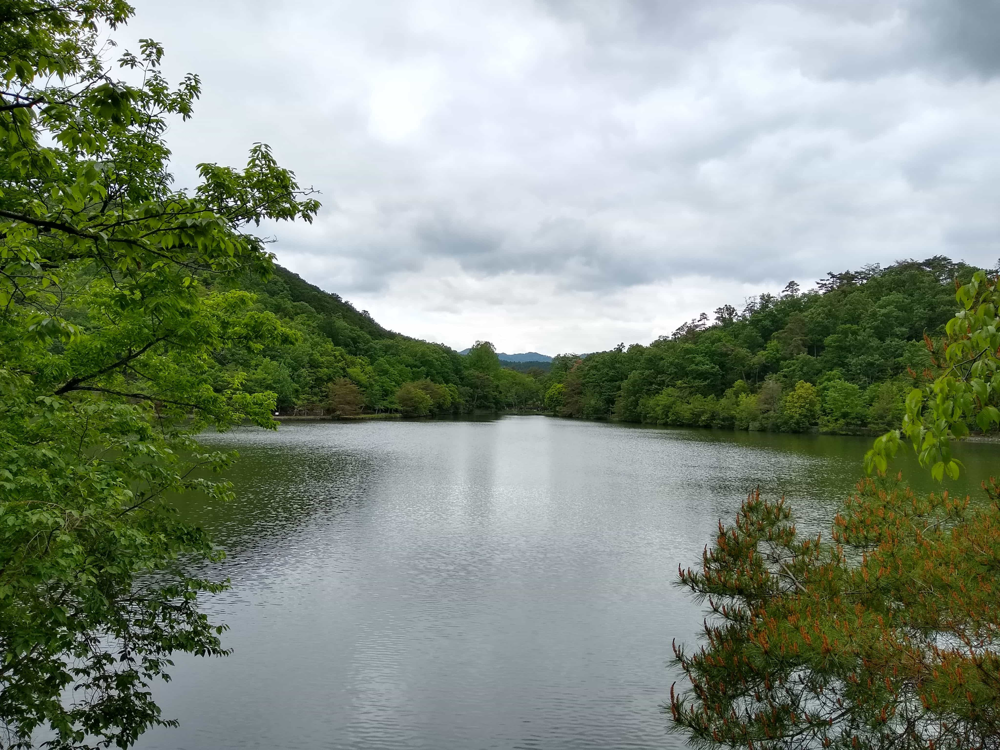

↑宝が池公園

↑上賀茂神社のキショウブ

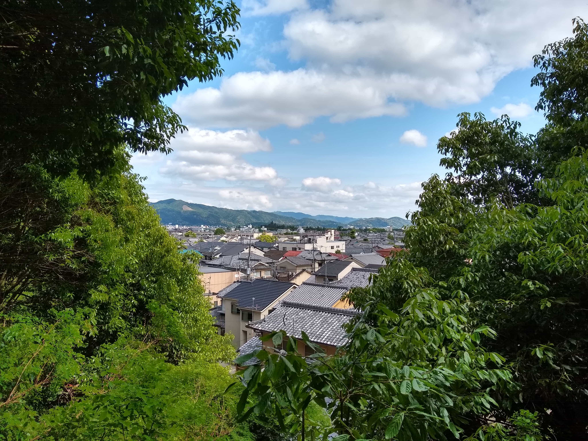

↑上御霊神社から盆地を眺める

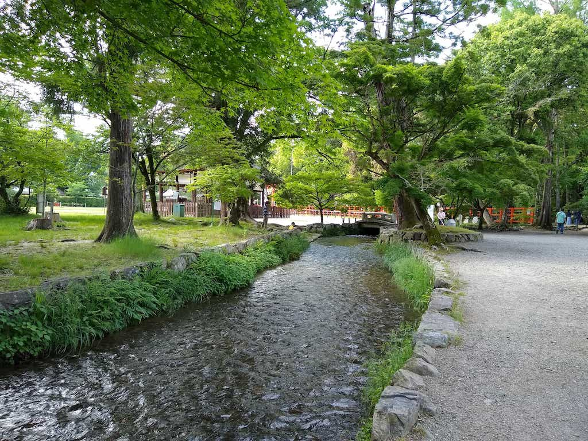

↑楢の小川@上御霊神社

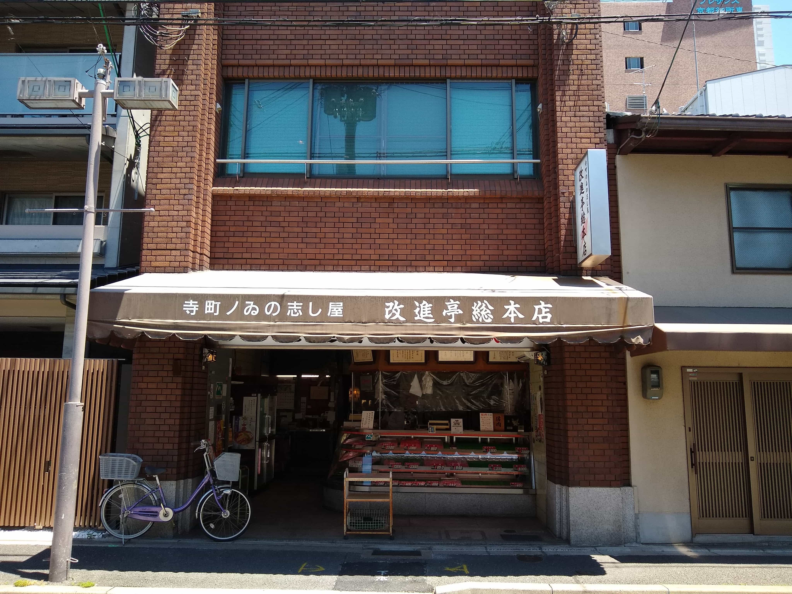

↑「いのしし」って読めない@寺町今出川上ル

↑あじさい

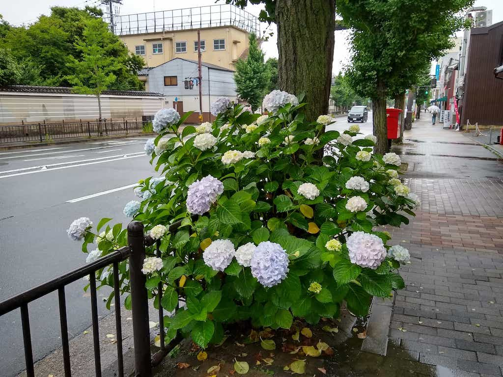

↑あじさい2

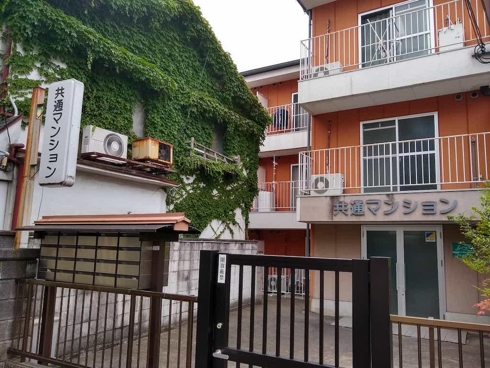

↑何が共通してるのか

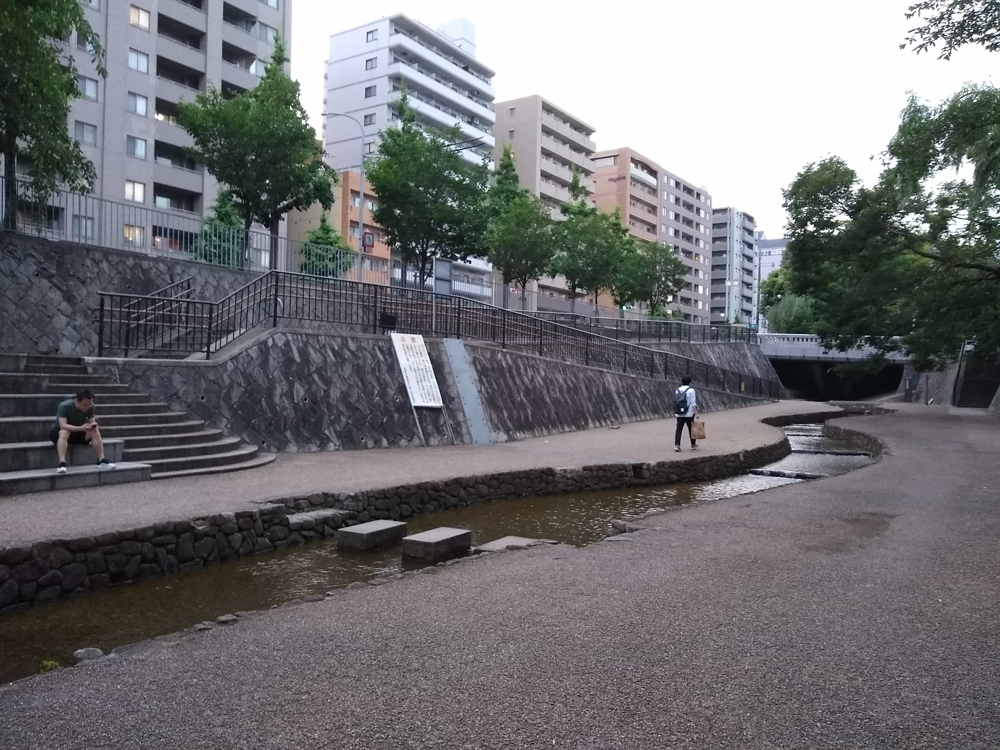

↑堀川の遊歩道

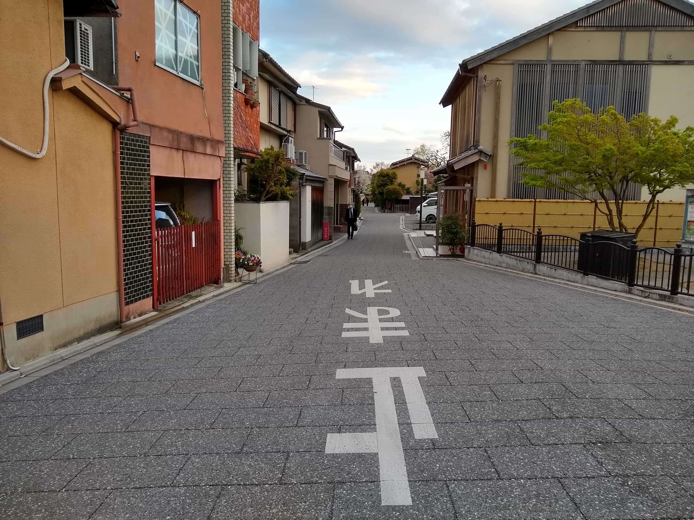

↑茶道関係の施設がある小川通

---

## 夏2020

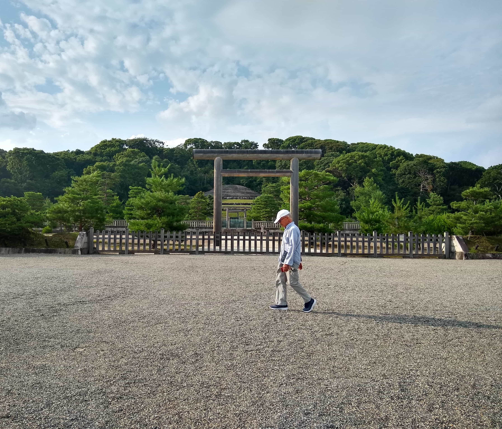

↑伏見の明治天皇陵